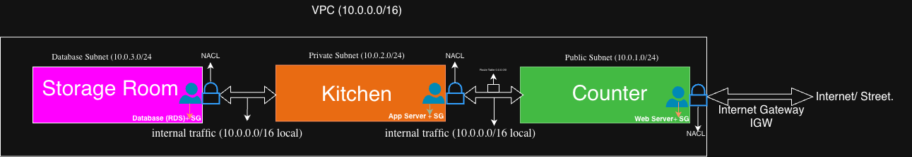

## Week 2 Architecture

A three-tier VPC architecture built from memory — public subnet (web server), private subnet (app server), and database subnet, connected via Internet Gateway with NACL and Security Group protection at every layer.