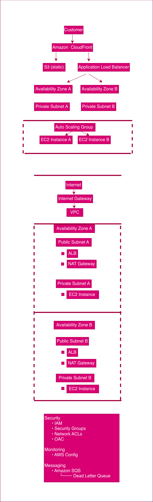

# Case Study: VPC + Config + Security

**Author:** Adebola Shopeju
**Program:** AWS Cloud Architect Pathway Week 7, Day 5 (Consolidation)

## Overview

This case study documents a secure, multi AZ web application architecture on AWS, combining VPC networking design, AWS Config for compliance monitoring, and a layered security model.

## 1. VPC Architecture

The architecture is built on a custom VPC spanning two Availability Zones (AZ A and AZ B) for high availability. Traffic flows from the internet through an Internet Gateway (IGW) attached to the VPC.

Each AZ contains:

- **Public Subnet** → hosts the Application Load Balancer (ALB) and a NAT Gateway. The public subnet's route table sends `0.0.0.0/0` traffic to the IGW.
- **Private Subnet** → hosts the EC2 instances (managed by an Auto Scaling Group). The private subnet's route table sends outbound `0.0.0.0/0` traffic to the NAT Gateway in the same AZ, so instances can reach the internet (e.g., for OS updates) without being directly reachable from it.

In front of the VPC, **Amazon CloudFront** serves as the entry point for customer traffic, routing static content requests to an **S3 bucket** and dynamic requests to the **Application Load Balancer**, which distributes traffic across EC2 instances in both AZs.

**Route tables:**
- Public route table → local + IGW route
- Private route table → local + NAT Gateway route (one NAT Gateway per AZ, to avoid a single point of failure and cross-AZ data transfer costs)

**Security Groups vs Network ACLs:**
- **Security Groups (stateful):** attached at the instance/ALB level; return traffic is automatically allowed. Used to control access between the ALB, EC2 instances, and any data stores.
- **Network ACLs (stateless):** attached at the subnet level; both inbound and outbound rules must be explicitly defined. Used as a coarser second layer of defense at the subnet boundary.

## 2. AWS Config

AWS Config provides continuous compliance monitoring and change tracking across the architecture:

- **Resource tracking:** Config records configuration changes to EC2 instances, the VPC, subnets, and Security Groups over time, creating an auditable history of what changed and when.
- **Compliance rules:** Managed rules are used to enforce security best practices for example, a rule flags any S3 bucket that becomes publicly accessible, and another checks that Security Groups don't allow unrestricted SSH (port 22) from `0.0.0.0/0`.
- **Drift detection and notification:** When a resource's configuration drifts out of compliance (e.g., a Security Group rule is loosened), Config evaluates it against the relevant rule and can trigger an SNS notification so the team is alerted immediately rather than discovering the issue during an audit.

This closes the loop between *designing* secure infrastructure and *proving* it stays secure over time.

## 3. Security

Security is layered across identity, network, and application controls:

- **IAM least privilege:** Every role (EC2 instance role, CI/CD role, Config service role) is scoped to only the permissions it needs for example, the EC2 instance role can read from a specific S3 bucket but cannot delete objects or modify IAM itself.
- **Security Groups vs NACLs:** As above SGs handle fine grained, stateful rules per resource; NACLs provide a stateless subnet level backstop.
- **S3 bucket policy with OAC:** The S3 bucket serving static content is not publicly accessible. Instead, an Origin Access Control (OAC) is attached to the CloudFront distribution, and the bucket policy only allows `s3:GetObject` requests that come from that specific CloudFront distribution. Direct requests to the S3 URL return `403 Forbidden`.
- **GuardDuty:** Continuously monitors for threats such as unusual API calls, compromised credentials, or reconnaissance activity against the account, complementing Config's compliance checks with active threat detection.
- **AWS WAF:** Sits in front of the ALB/CloudFront to filter out common web application attacks (SQL injection, XSS) before they reach the application layer.
- **Messaging security:** Amazon SQS decouples services in the architecture; a dead letter queue (DLQ) captures messages that fail processing after 3 receive attempts, preventing poison messages from looping indefinitely.

## 4. Architecture Diagram

The diagram shows the full request path (Customer → CloudFront → S3/ALB → Auto Scaling Group across two AZs) and the underlying VPC layout (IGW → VPC → per-AZ public/private subnets with NAT Gateways), alongside the security, monitoring, and messaging controls applied across the stack.

## Summary

This architecture demonstrates a secure, highly available design: traffic is distributed across two AZs, private resources are shielded behind NAT Gateways and layered SG/NACL rules, S3 origins are locked down via OAC, AWS Config continuously verifies compliance, GuardDuty and WAF provide active threat protection, and SQS with a DLQ ensures reliable, decoupled message processing.
