# Week 10 Day 1 — AWS Lambda Fundamentals

## Overview

This lab introduced the fundamentals of **AWS Lambda**, focusing on how to create, configure, invoke, monitor, and troubleshoot a serverless function.

The lab was completed in the **AWS Europe (London) Region (`eu-west-2`)** using Python 3.14.

### What I Practised

* Creating an AWS Lambda function
* Understanding the Lambda handler
* Working with the `event` and `context` objects
* Configuring environment variables
* Testing Lambda functions
* Writing logs with Python's `print()` and `logging`
* Using Amazon CloudWatch Logs
* Troubleshooting Lambda errors
* Understanding cold starts and warm starts
* Invoking Lambda from the AWS CLI
* Retrieving Lambda logs from the AWS CLI

### Lambda Function

**Function name:** `w10-hello`

**Runtime:** Python 3.14

**Region:** `eu-west-2`

**Memory:** 128 MB

## 1. Creating the Lambda Function

I created a Lambda function named `w10-hello` using the Python 3.14 runtime.

The function was created without managing any servers or installing an operating system. AWS provides the execution environment and runs the function when it is invoked.

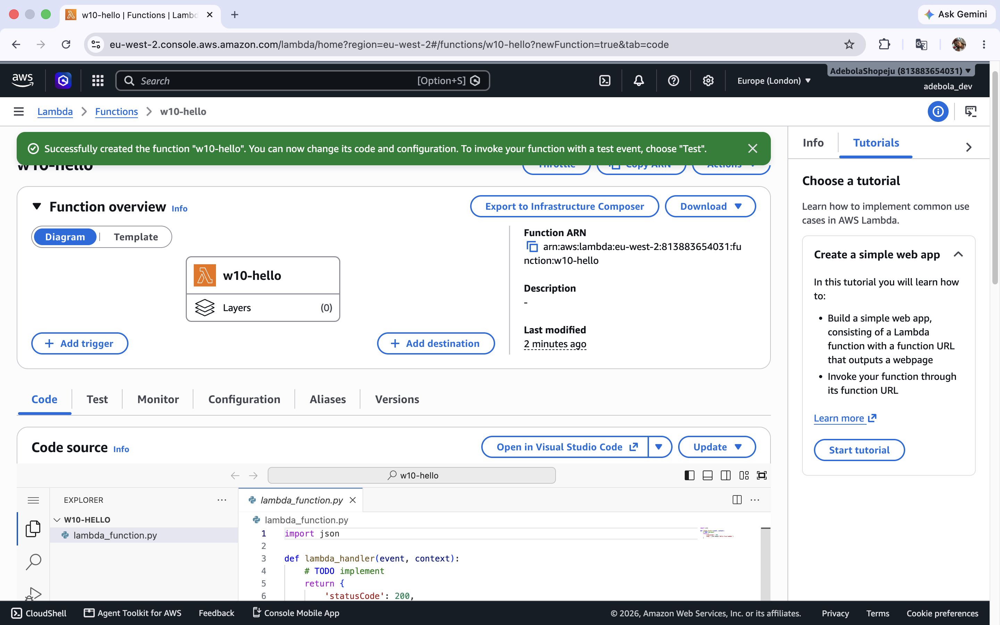

### Understanding the Lambda Handler

The Lambda function uses the handler:

`lambda_function.lambda_handler`

This follows the pattern:

```text
filename.function_name
```

Therefore:

* `lambda_function` → the Python file containing the code
* `lambda_handler` → the Python function AWS Lambda calls

The initial Lambda code included two important parameters:

```python
def lambda_handler(event, context):
```

`event` contains information passed to the function when it is invoked.

`context` contains information about the current Lambda invocation, such as the request ID and function name.

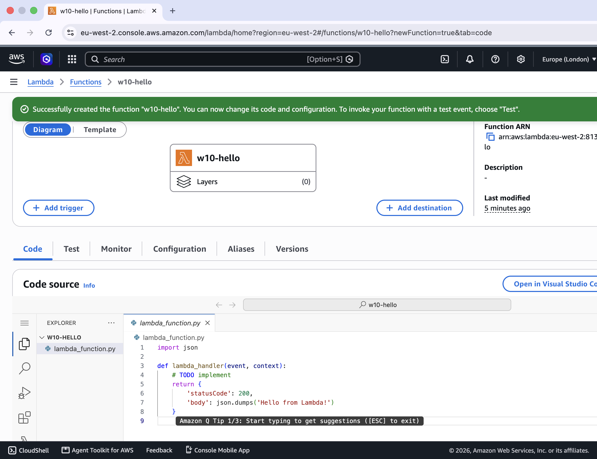

### Testing the Function

I created a test event named `hello-test` and invoked the Lambda function.

The test event supplied sample JSON data:

```json
{
  "key1": "value1",
  "key2": "value2",
  "key3": "value3"
}
```

The function successfully returned:

```text
Hello from Lambda!
```

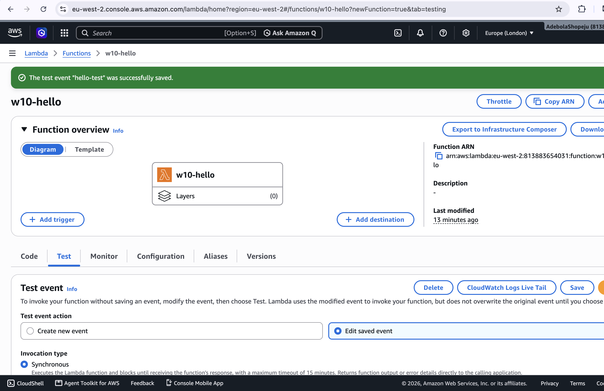

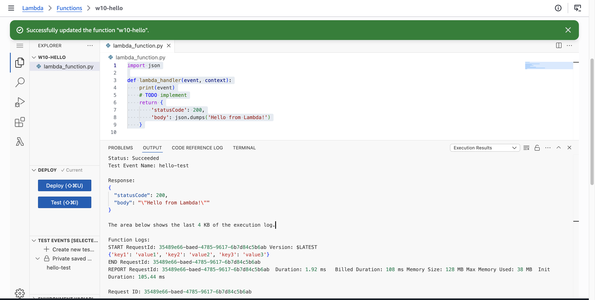

## 2. Lambda Handler Troubleshooting

To understand how the handler configuration works, I deliberately changed the Lambda handler to an incorrect function name:

```text 
lambda_function.wrong_handler
```

I then saved the configuration and invoked the function.

Lambda returned:

```text 
Runtime.HandlerNotFound: Handler 'wrong_handler' missing on module 'lambda_function'
```

This error means Lambda successfully found the Python file `lambda_function`, but it could not find a Python function named `wrong_handler` inside that file.

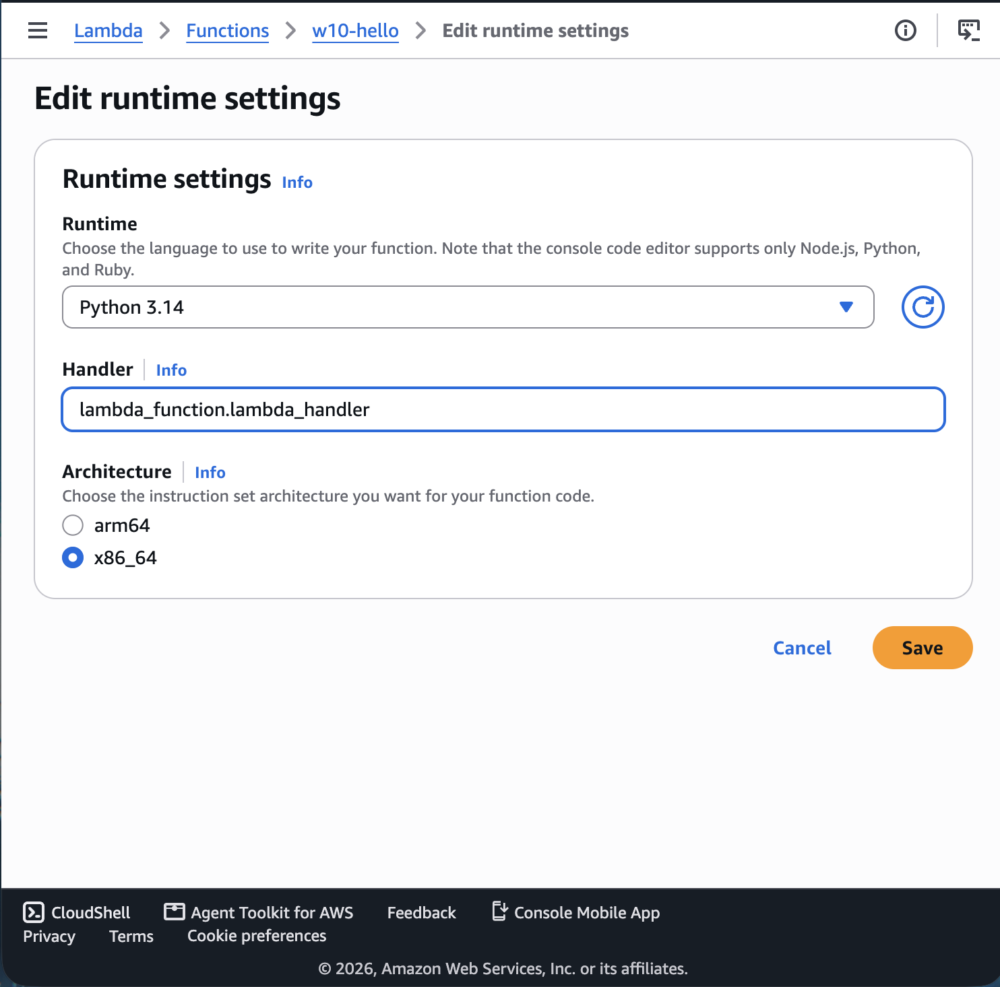

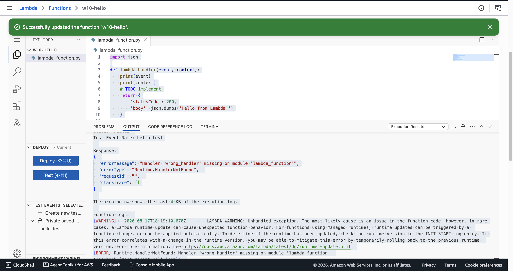

### Fixing the Handler

I corrected the handler back to:

```text 
lambda_function.lambda_handler
```

After saving the change and testing the function again, the invocation succeeded.

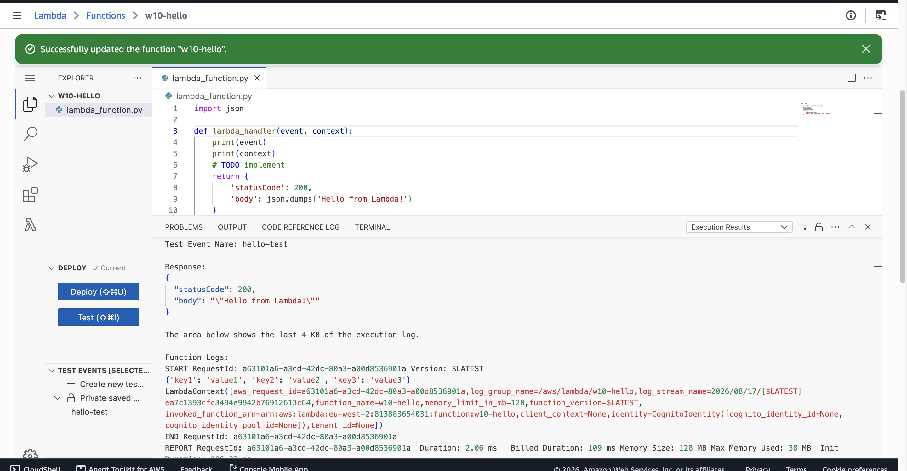

### What I Learned

The handler is effectively the **address Lambda uses to find the code it needs to run**.

For example:

```text 
lambda_function.lambda_handler
       ↓               ↓
   Python file     Python function
```

If either part is wrong, Lambda cannot start the function correctly.

This was my first deliberate Lambda configuration error, and I used the error message to identify exactly what needed to be corrected.

## 3. Environment Variables

I added an environment variable to the Lambda function.

Environment variables allow configuration values to be stored **outside of the function's main source code**.

For this lab, the environment variable was used to demonstrate that Lambda code can retrieve configuration values from its execution environment.

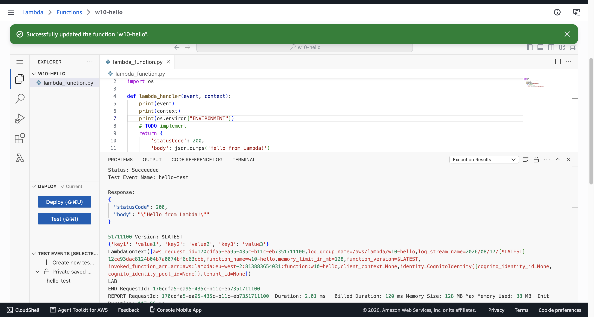
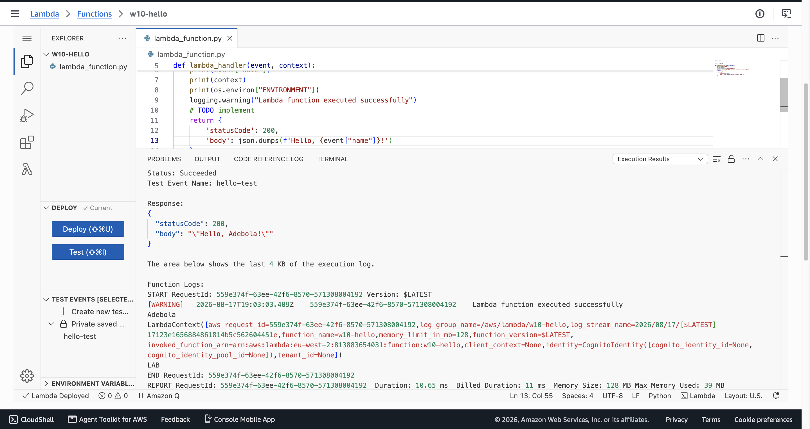

### Why Use Environment Variables?

Without an environment variable, a value might be written directly into the code:

```python 
name = "Adebola"
```

With an environment variable, the value can be kept in Lambda's configuration instead.

The Python function can retrieve it using the operating system environment:

```python 
import os

name = os.environ.get("NAME")
```

This separates **configuration** from **application code**.

### Why This Matters

This becomes particularly useful when the same Lambda function needs different configuration values in different environments.

For example:

```text 
Development → NAME=Development
Testing     → NAME=Testing
Production  → NAME=Production
```

The code can remain the same while the configuration changes.

Environment variables are therefore useful for **configuration**, although sensitive secrets should generally be stored using purpose-built AWS services rather than being placed directly in Lambda environment variables.

## 4. Logging with Amazon CloudWatch

AWS Lambda automatically integrates with **Amazon CloudWatch Logs**.

When the function runs, Lambda creates a log stream and records information about the invocation, including:

* `START` — the invocation began
* Application messages produced by the function
* `END` — the invocation finished
* `REPORT` — execution and resource information

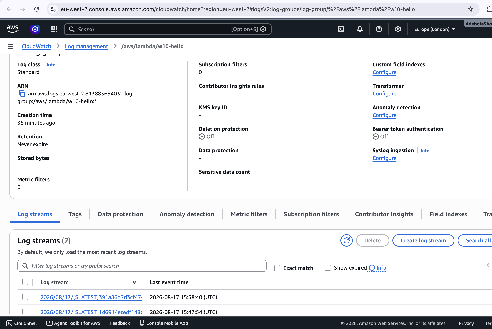

### Custom Application Logging

I added custom logging to the Lambda function so that I could identify information generated by my own code.

The logs included:

```text 
Adebola
LAB
Lambda function executed successfully
```

These messages allowed me to distinguish my application's output from Lambda's automatically generated execution information.

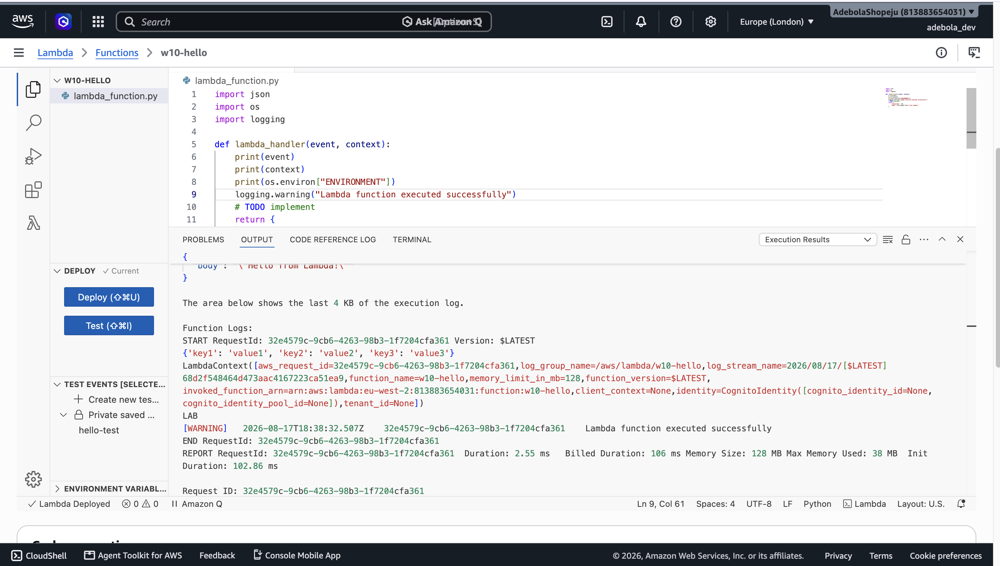

### Understanding the Lambda Context

I also printed the `context` object:

```text 
LambdaContext(...)
```

The context contains information about the current invocation, including:

* AWS request ID
* Function name
* Memory limit
* Function version
* Log group name
* Log stream name
* Invoked function ARN

This demonstrated that Lambda provides the function with information about the execution environment through the `context` parameter.

### CloudWatch Log Streams

Lambda writes invocation logs to CloudWatch Logs, where logs are organized into log groups and log streams.

I inspected the log streams created for `w10-hello` and compared executions occurring at different times.

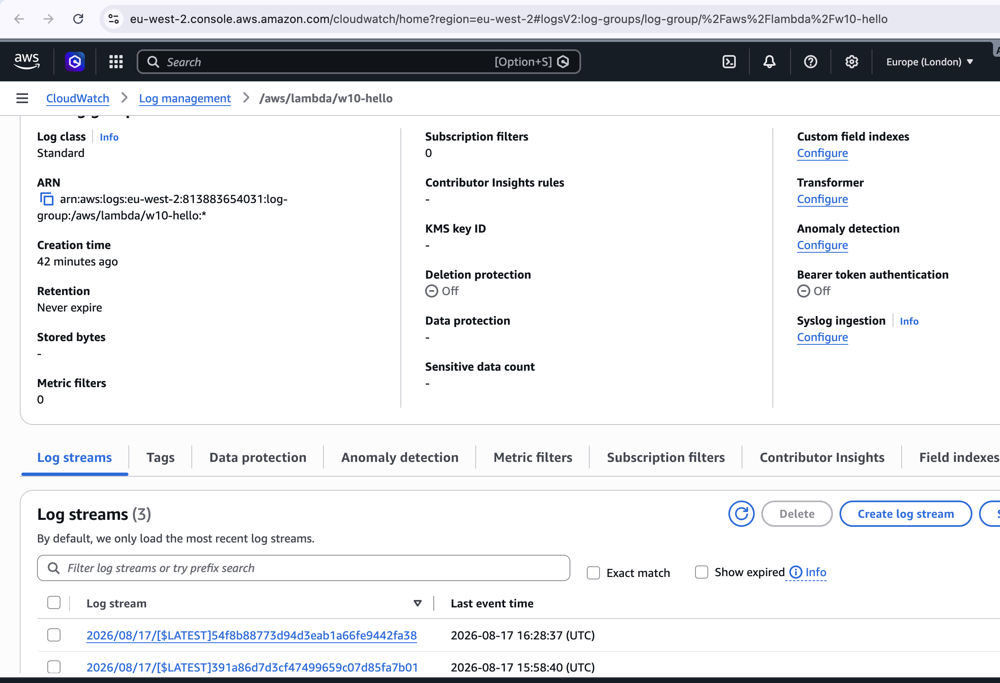

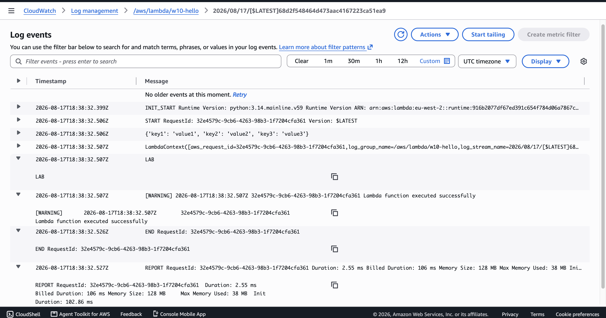

This helped me connect the Lambda invocation with the logs generated by that invocation.

## 5. Lambda Runtime Error and Troubleshooting

I deliberately introduced an error into the Lambda function by attempting to divide a number by zero:

```python 
print(10 / 0)
```

When I invoked the function, Lambda returned:

```text 
ZeroDivisionError: division by zero
```

The error response also identified the exact location of the problem:

```text 
File "/var/task/lambda_function.py", line 10, in lambda_handler
    print(10 / 0)
```

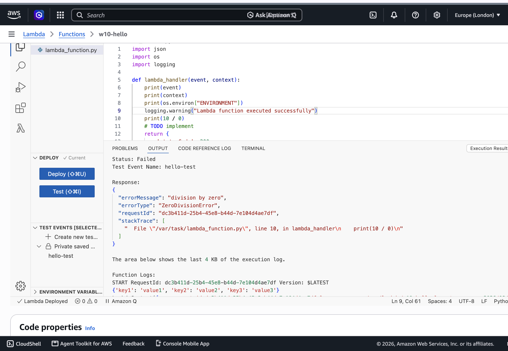

### What the Error Demonstrated

This showed the difference between a **successful Lambda invocation** and a **function that starts but fails while executing its code**.

The function was able to:

1. Start the Lambda execution environment.
2. Load the Python module.
3. Find the correct `lambda_handler`.
4. Begin executing the function.
5. Fail when it reached `10 / 0`.

This is different from the earlier `HandlerNotFound` error, where Lambda could not locate the function it was supposed to execute.

### CloudWatch Error Logging

The runtime error was also recorded in CloudWatch Logs:

```text 
[ERROR] ZeroDivisionError: division by zero
```

This demonstrates how CloudWatch can be used to investigate Lambda failures after an invocation.


### Restoring the Function

I removed the deliberate division-by-zero error, saved the function, and invoked it again.

The function successfully returned:

```json 
{
  "statusCode": 200,
  "body": "\"Hello from Lambda!\""
}
```

This confirmed that the function had been restored to a working state.

## 6. Lambda Cold Starts and Warm Starts

During the lab, I observed Lambda execution timing across multiple invocations.

### Cold Start

The first invocation of a Lambda execution environment requires AWS to initialize the runtime before executing the function.

The CloudWatch log showed an initialization duration:

```text 
Init Duration: 102.02 ms
```

This initialization time is associated with starting the execution environment.

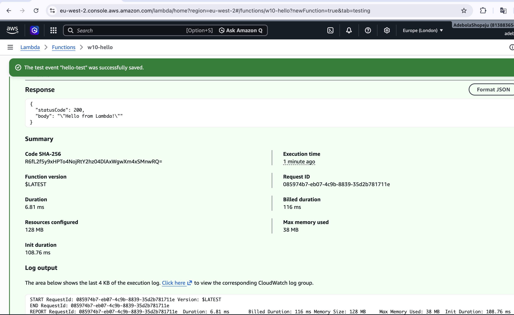

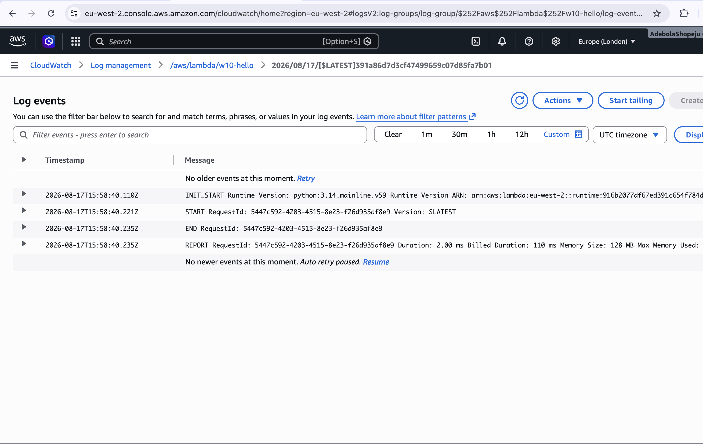

### Warm Start

I then invoked the function again while Lambda could reuse an existing execution environment.

The subsequent invocation did not show an `Init Duration` in the same way as the initial cold-start execution.

The execution completed successfully with a short duration:

```text 
Duration: 2.66 ms
Billed Duration: 115 ms
```

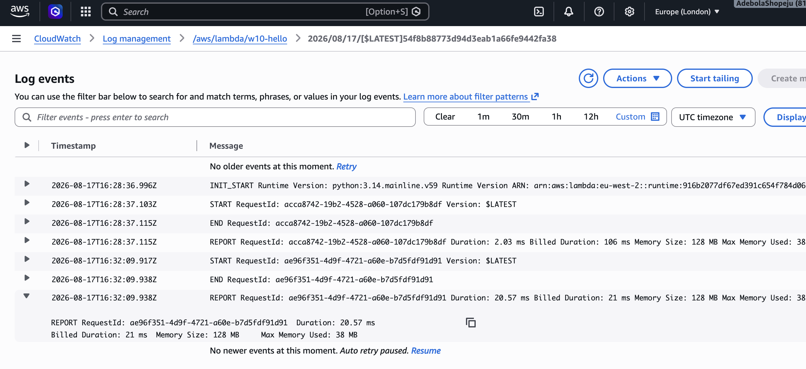

### What I Learned

The key difference is:

```text 
Cold start
    ↓
Lambda creates/initializes an execution environment
    ↓
Function runs

Warm start
    ↓
Lambda reuses an existing execution environment
    ↓
Function runs
```

A warm start can therefore avoid the initialization work required during a cold start.

However, Lambda execution environments can be reused or removed by AWS, so applications should not depend on an execution environment remaining available indefinitely.

## 7. Invoking Lambda from the AWS CLI

After testing the function through the AWS Console, I invoked the same Lambda function from my Mac using the AWS CLI.

First, I confirmed that the AWS CLI was authenticated to the correct AWS account:

```bash
aws sts get-caller-identity
```

The command confirmed the IAM identity being used by the AWS CLI.

### Invoking the Function

I invoked the Lambda function using:

```bash
aws lambda invoke \
  --function-name w10-hello \
  --payload '{"name":"Adebola"}' \
  --cli-binary-format raw-in-base64-out \
  response.json
```

The invocation returned:

```text
StatusCode: 200
ExecutedVersion: $LATEST
```

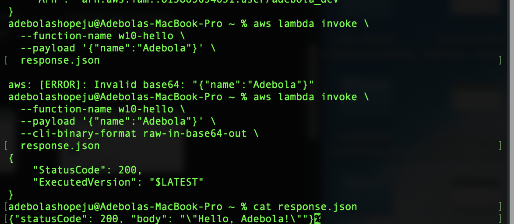

### Why `--cli-binary-format` Was Required

The first attempt failed with:

```text
Invalid base64
```

The AWS CLI interpreted the JSON payload as base64-encoded data.

Adding:

```text
--cli-binary-format raw-in-base64-out
```

told the AWS CLI to treat the supplied JSON as raw input.

The second invocation succeeded.

### Inspecting the Response

The Lambda response was written to `response.json`.

I inspected it using:

```bash
cat response.json
```

The result was:

```json
{
  "statusCode": 200,
  "body": "\"Hello, Adebola!\""
}
```


This demonstrated that Lambda can be invoked programmatically without using the AWS Management Console.

## 8. Retrieving Lambda Logs from the AWS CLI

After invoking the Lambda function from the AWS CLI, I retrieved its CloudWatch logs directly from the terminal.

I used:

```bash 
aws logs tail /aws/lambda/w10-hello --since 10m
```

This returned the recent Lambda execution logs, including:

* `START`
* My custom log messages
* Lambda context information
* `END`
* `REPORT`
* Execution duration
* Billed duration
* Memory allocation
* Maximum memory used

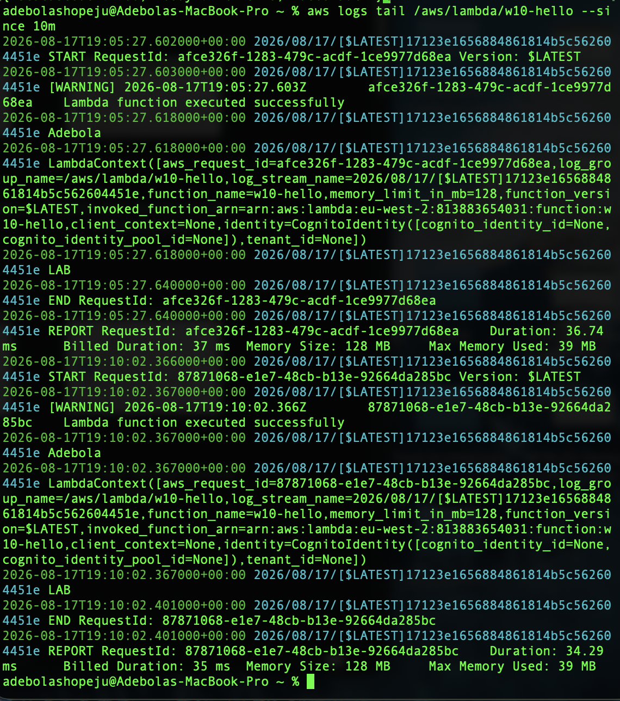

### What This Demonstrated

I was able to follow the complete path of a Lambda invocation:

```text 
AWS CLI
   ↓
Invoke Lambda
   ↓
Lambda executes
   ↓
Lambda generates logs
   ↓
CloudWatch Logs
   ↓
AWS CLI retrieves the logs
```

This is useful for troubleshooting because I can inspect Lambda execution activity without needing to open the AWS Management Console.

---

## 9. Key Lessons

This lab helped me understand Lambda as more than simply "running Python in AWS."

I learned that:

1. **Lambda runs code without me managing servers.**
2. The **handler** tells Lambda which Python function to execute.
3. The **event** contains information passed into the function.
4. The **context** provides information about the current invocation.
5. **Environment variables** allow configuration to be separated from application code.
6. Lambda automatically sends execution logs to **CloudWatch Logs**.
7. A **handler error** occurs when Lambda cannot find the configured function.
8. A **runtime error** can occur after the function has successfully started executing.
9. **Cold starts** require initialization of the execution environment.
10. **Warm starts** can reuse an existing execution environment.
11. Lambda can be invoked from the **AWS CLI**.
12. CloudWatch logs can also be retrieved from the **AWS CLI**.

### Troubleshooting Experience

One of the most valuable parts of this lab was intentionally creating errors and fixing them.

I encountered:

```text 
Runtime.ImportModuleError
HandlerNotFound
ZeroDivisionError
Invalid base64
```

Rather than treating errors as failures, I used the error messages and logs to understand **where the problem occurred and why**.

This gave me practical experience with the Lambda troubleshooting workflow:

```text 
Observe the error
      ↓
Read the error message
      ↓
Identify where the failure occurred
      ↓
Fix the configuration or code
      ↓
Save the change
      ↓
Invoke the function again
      ↓
Confirm successful execution
```

## Conclusion

This lab gave me my first practical end-to-end experience with AWS Lambda, including creation, configuration, execution, logging, troubleshooting, cold and warm starts, and CLI-based operation.

The next step is to connect Lambda to other AWS services so that the function can respond to real events rather than only manual test invocations.
